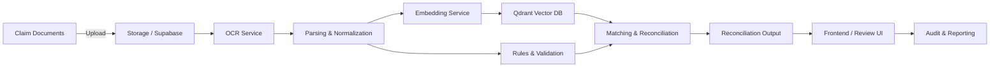
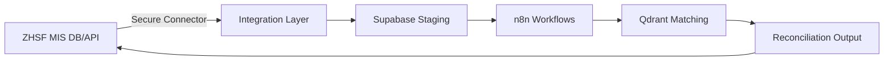

# ZHSF AI Claims Reconciliation — Developer Training & Onboarding

This document is the step-by-step onboarding and workshop plan for the ZHSF developer team. It includes the technical architecture, deployment steps, and a 3‑day workshop plan, followed by a 3‑day hackathon plan for integrating the real ZHSF database and APIs.

---

## 1) Goals & Outcomes

### Training outcomes (3 days)
- Understand all technical components in the current repository and how they work together.
- Deploy the stack locally and verify data flow.
- Learn how to modify workflows, data schemas, and vector/AI processing.
- Prepare the team for production integration and ZHSF data center deployment.

### Hackathon outcomes (additional 3 days)
- Replace mock data with ZHSF MIS database and APIs.
- Implement secure networking, credentials, and data governance.
- Provide robust end‑to‑end reconciliation flows with auditability.
- Deliver a production‑ready deployment plan and runbook.

---

## 2) Architecture Overview

### Core components and their roles
- **n8n**: Workflow engine orchestrating ingestion, OCR, parsing, validation, matching, and reconciliation steps.
- **Supabase**: Data layer (Postgres + APIs + storage) used for staging claims data, reference data, and output results.
- **Qdrant**: Vector database for similarity search (e.g., matching claim documents to reference records).
- **OCR**: Extracts text from scanned claims. (PaddleOCR used here.)
- **Frontend**: UI for monitoring, manual review, and reconciliation verification.
- **Docker Compose**: Orchestrates all services in a consistent, reproducible environment.

### How components work together
1. Claim documents are uploaded to storage.
2. OCR extracts text and stores structured outputs.
3. Parsing/normalization prepares claims data for matching.
4. Vector embeddings are created and stored in Qdrant.
5. Matching logic compares claim data vs reference data (from ZHSF MIS).
6. Reconciliation outputs are written back to the data layer.
7. Frontend provides review workflows and audit trails.

---

## 3) System Diagram (Logical)

---

## 4) Workshop Plan (3 Days)

### Day 1 — Environment & Core Services
**Objectives**: Understand repository structure, run services locally, inspect data flows.

1. **Introduction & walkthrough (1h)**
   - Repository structure and key folders
   - Overview of n8n workflows and Supabase schemas
2. **Local deployment (2h)**
   - Set up `.env`
   - Start services with `make start`
   - Verify n8n and Supabase Studio
3. **Service discovery (2h)**
   - Explore n8n nodes and example workflows
   - Inspect Supabase tables and storage
4. **Hands-on exercise (2h)**
   - Upload a sample claim document
   - Run the OCR and parsing pipeline
   - Validate stored outputs

### Day 2 — Data Flow & Matching Logic
**Objectives**: Understand document processing, matching logic, and reconciliation outputs.

1. **OCR and parsing pipelines (1.5h)**
   - Extract text and validate outputs
   - Normalization steps
2. **Vector embeddings (1.5h)**
   - Generate embeddings
   - Store in Qdrant
   - Run similarity queries
3. **Reconciliation logic (2h)**
   - Matching rules
   - Confidence scoring
   - Exceptions and manual review
4. **Hands-on exercise (2h)**
   - Tune matching thresholds
   - Compare outputs for multiple claim types

### Day 3 — Deployment & Operations Readiness
**Objectives**: Prepare for integration into the ZHSF data center and production readiness.

1. **Deployment strategy (2h)**
   - Docker Compose as baseline
   - Separation for production
2. **Security & governance (2h)**
   - Secret management
   - Data access controls
   - Audit logging strategy
3. **Monitoring & troubleshooting (2h)**
   - Service health checks
   - Logging and alerting
4. **Go‑live checklist (1h)**
   - Pre‑deployment checks
   - Rollback plan

---

## 5) Step‑by‑Step Deployment (Local / Staging)

1. **Install prerequisites**
   - Docker & Docker Compose
2. **Configure environment**
   - Copy `.env.template` to `.env`
   - Update DB, storage, and secret variables
3. **Start services**
   - `make start`
4. **Verify services**
   - n8n: `http://localhost:5678`
   - Supabase Studio: `http://localhost:3000`
   - Qdrant: `http://localhost:6333`
5. **Initialize data**
   - Create initial tables in Supabase
   - Load sample claim data and reference data
6. **Run reconciliation workflow**
   - Execute n8n workflow for OCR → matching → reconciliation
7. **Review outputs**
   - Check reconciliation tables
   - Validate UI results

---

## 6) Integration Plan for ZHSF MIS (Real DB & API)

### Required integration work
- Replace mock data sources with ZHSF MIS database connections.
- Implement secure API access and data transformation layers.
- Align data schemas with ZHSF MIS tables.
- Ensure auditability and compliance (logging, traceability).

### Proposed integration architecture

---

## 7) Hackathon Plan (3 Days, 4 Teams)

### Structure
- **Duration**: 3 days
- **Teams**: 4 teams, 3 members each
- **Daily rhythm**:
  - Morning: Stand‑up + review tasks
  - Mid‑day: Integration sprint
  - End of day: Demo & retrospective

### Team 1: Data Integration & Connectivity
**Goal**: Connect to the real ZHSF MIS database and APIs.

**User stories**
- As a system integrator, I can connect to ZHSF MIS DB with secure credentials so that real claim data can be retrieved.
- As a data engineer, I can map ZHSF MIS tables to staging schemas so reconciliation works with real data.

**Tasks**
- Define secure DB connectivity (VPN, firewall rules, or gateway).
- Implement read‑only access user for ZHSF MIS.
- Build ETL/ELT pipelines to load data into Supabase staging.
- Validate data mappings with sample records.

### Team 2: Workflow & Matching Logic
**Goal**: Update workflows to use real MIS data and improve accuracy.

**User stories**
- As a workflow developer, I can update n8n workflows to fetch real data from staging tables.
- As a reconciliation analyst, I can tune matching thresholds and rules for production use.

**Tasks**
- Replace mock data nodes with real staging queries.
- Update validation rules to align with MIS constraints.
- Optimize matching scoring and exception handling.
- Test reconciliation outputs on sample batches.

### Team 3: Security, Compliance & Observability
**Goal**: Ensure secure deployment and monitoring in ZHSF data center.

**User stories**
- As a security officer, I can enforce least‑privilege access so data remains protected.
- As an operator, I can monitor workflows and detect failures in real time.

**Tasks**
- Configure secrets management (vault or env‑based).
- Implement role‑based access in Supabase/n8n.
- Add logging, alerting, and audit trails.
- Define incident response runbook.

### Team 4: Frontend & User Validation
**Goal**: Ensure reconciliation outputs are usable and clear for reviewers.

**User stories**
- As a reviewer, I can see reconciliation results and exceptions in the UI.
- As a supervisor, I can export reports for audit purposes.

**Tasks**
- Update frontend to reflect real data fields.
- Add filters and export options.
- Validate manual review flows.
- Prepare user training guides.

---

## 8) Final Deliverables

### End of workshop
- All developers can deploy and run the stack locally.
- All core workflows validated with sample data.
- Shared architecture understanding.

### End of hackathon
- Integrated ZHSF MIS data sources.
- Stable reconciliation pipeline with monitoring and audit.
- Deployment plan for ZHSF data center.
- Documented runbook and training material for operations.

---

## 9) Checklist for ZHSF Data Center Deployment

- [ ] Networking and secure access configured
- [ ] Secrets management enabled
- [ ] MIS database connectivity verified
- [ ] ETL pipelines tested
- [ ] Workflows validated with real data
- [ ] Monitoring and alerting enabled
- [ ] Backup and restore procedures documented
- [ ] Go‑live checklist signed

---

## 10) Next Steps
- Review workshop plan with ZHSF stakeholders
- Confirm access requirements for MIS systems
- Schedule hackathon and assign team leads

